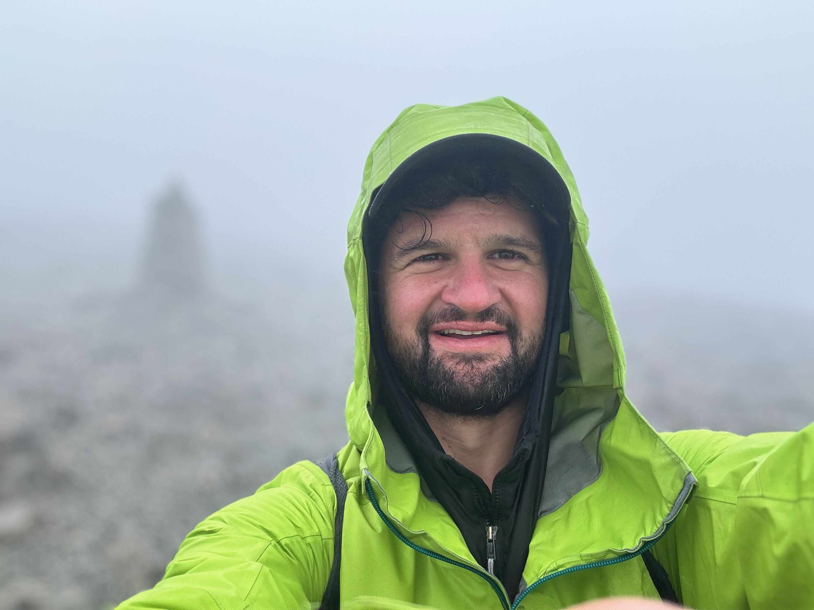

<figure style="width: 300px;">
  
</figure>

Hi — I'm John. I am a researcher, entrepreneur and investor helping build a brighter future.

My work is focused on how we can use emerging technologies to improve measures of planetary stewardship and human dignity. Currently, I'm working on decentralized geospatial systems:

- I am building [Astral](https://astral.global/), the trust layer for location data — infrastructure that makes geospatial information verifiable and usable across blockchains and the web.
- I am a Research Affiliate at the [University of Maryland](https://decentralizedgeo.org/), doing R+D on location proofs and other decentralized geospatial web technologies.
- I also consult, invest and advise startups in climate, Web3, AI, geospatial, and other sectors via [Sophia Systems](https://sophiasystems.io/) and The Applewood Group.

Over the years I've been involved in a meandering range of projects — from setting up onchain carbon markets at [Toucan](https://toucan.earth/), to studying maritime security as a geospatial data scientist at an [international NGO](https://www.stableseas.org/), to leading developer ecosystem growth at [Ordnance Survey](https://www.ordnancesurvey.co.uk/), the UK's national mapping agency. I hold an MSc in Spatial Data Science and Visualisation from UCL with Distinction. It's ancient history at this point, but in a prior era I was a ski patroller with the NSP, an active travel guide with Backroads, and a cliff diver at Casa Bonita ...  

- Read about what I’m thinking and learning: [Observations→](https://www.x25bd.com/observations)
- Learn more about my background: [LinkedIn→](https://www.linkedin.com/in/johnx25bd/)
- Reach out: [Contact→](https://www.x25bd.com/pages/contact)

Along with my work, I love sailing downwind, snowboarding in powder, and unhurried departures. I'm from Denver, and based in north London.