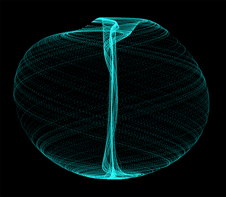

It always feels a bit arrogant of me to post my thoughts in a public place. I sit down to write — the interior voice swirls in an imaginary conversation with a potential reader: "Who am I to expect you to read this? Your attention is the most valuable thing you have — if I'm going to ask for it, I better have something worthwhile to say ..." In the [Age of Attention](https://www.cambridge.org/core/books/stand-out-of-our-light/age-of-attention/906312B06CA0C5B1F0C9AACA11ED339B), I don't want to be another voice clamoring for your time — there's already too much competition for that.

But I also know that [conversation](https://www.kernel.community/en/learn/module-0/conversation) is the surest path to mutual understanding. And the truth is, [right](https://www.ipcc.ch/report/sixth-assessment-report-cycle/) [now](https://www.economist.com/business/2023/10/29/americas-economy-is-booming-why-arent-its-bosses-happier) [feels](https://www.ft.com/content/c8d52c00-90c4-4a9e-9251-34a8d1e9bc80) [like](https://ourworldindata.org/illicit-drug-use) a [moment](https://www.nytimes.com/2023/11/01/world/europe/uk-ai-summit-sunak.html) when deeper understanding is a worthwhile thing to pursue. So I'm pushing myself to write — 50% to make sense of the world, 25% to invite criticism and sharpen my thinking, and 25% to report on what I'm seeing from my limited perspective on the world. 

## Disclaimers

To share these ideas in good faith, I feel like I need to post the requisite disclaimers. These are more for me than for anyone — a statement of intent that establishes the boundaries of _what_ I'm willing to put into the world. 

When I was much younger, I used to share much more freely than I do now. But at a certain point I began to feel very cautious about what I say out loud, especially online. This might be worth its own post some day, but it's based on my realization that on the Internet everything is permanent, and online both intent and nuance are very fragile. I let fear hold me back. 

So why risk it? Why should I open my mouth now?

I have always struggled with the sentiment that "It'll be interesting to see what happens." This makes it seem as if we're all sitting on our sofas, passive observers watching the TV show of reality. But the truth is that **we are all participants**. We all have an impact in the world, just by being here. We all have a role to play. There is no "them". 

It's true, we each have our individual advantages and disadvantages in exactly what impact we can intentionally create, and we each operate within a locus of control that evolves throughout our lifetime. Not everyone has the same power, an imbalance with causes that range from deeply unjust to fair and well-earned. But every living thing — everything — has a right to be here and a role to play in however _this_ unfolds.

A year and a half ago I refocused my efforts "to fully express my gifts", as I put it then. I've always been impact-oriented, and I doubled down in my intention of using my life and time and energy to do my bit to improve our lot here on Earth, and to enjoy myself doing it. We exist within a [complex adaptive system](https://en.wikipedia.org/wiki/Complex_adaptive_system) — a world that cannot be fully predicted or controlled. However, accurate predictions can be made, and actions we take can affect outcomes — each enhanced massively by technology. As creatures that possess agency, we have a hand in how this unfolds. And by connecting with our intentions, we can consciously shape that unfolding to a small, but possibly meaningful, extent.

So this is a space where I will share what I'm thinking, with goals of developing a sharper understanding of things, connecting with people interested in collaborating, and possibly helping you see new connections and deepen your own insight into the world.

## What to expect

I'm naturally curious about the sticky challenges we face as a species. Throughout my career I've worked on addressing the drivers of human conflict and the climate breakdown, and have a personal interest in topics such as the governance / ethics of emerging technologies, privacy-preserving surveillance systems, philosophy of information, and optimistic storytelling to drive behavior change at scale. I've been drawn to learn about new technology domains that offer unprecedented potential in monitoring and predicting the physical state of the world (geospatial data) and coordinating the behavior of people, firms and governments on a global scale (Web3 / consensus networks) — tools for understanding and shaping complex adaptive systems. I also spend as much time as I can (admittedly less lately ... more on how I'm changing that soon) connecting with the beauty of the planet, exploring by natural power: spending time in the mountains and oceans we belong to on bikes, on boats and on foot. Beyond this, I've been learning about mindfulness, creativity, relationships, health, baking, pop culture, botany, literature, etc etc etc. I expect most of these threads will surface here, though I'm not being prescriptive about what form that will take. Anything goes.

The observations I share here will be deliberately incomplete. I will write things I'll change my mind on. I will go back and edit posts (and will indicate if I've changed things significantly). This is a space for me to post ideas that would earn a sloppy B — not a perfect A. In the past my compulsion to refine things to my ideal standard has held me back, and this is an exercise in sharing things before they're fully baked. I won't commit to a regular cadence for posting things, but I do intend to share early and often.

I will commit, however, to only post things that feel true to me in that moment. I will make sure I share ideas I think are worth reading. I will explain and justify my thinking, and cite evidence when appropriate. I will also place value in my intuition and gut feel. And I will always be open to feedback and criticism — in fact, I wholeheartedly invite it.

## A tipping point

I see that we are in a period of profound transition. Every year it's clearer and clearer to me that we are reaching tipping points in so many dimensions — environmental, social, political, personal, spiritual — and that we're being called to shepherd this shift we're witnessing. I believe our motivations should be to minimize the amount of damage and harm done as we transform the systems that exist within on scales ranging from the personal to the global, and ensure that the stable(r) state we reach at the end of this transition supports a planet flourishing with life. Those themes will hopefully penetrate the thinking I share here — all aimed at helping us strengthen our skills in planetary stewardship and deepen measures of human dignity.

<em>The Aizawa attractor, from <a href="https://www.algosome.com/articles/aizawa-attractor-chaos.html" target="_blank">Algosome</a></em>

