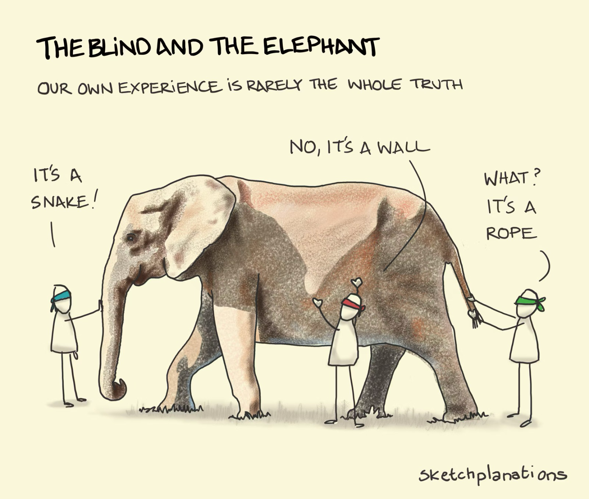

I find I often hold out on saying things, sharing my perspective and ideas, because I don’t feel like I have a good handle on the breadth and depth of the “cutting edge”. I feel that to credibly contribute to the conversation, I need to have done my homework. As evidence — I haven’t posted in almost a year, and rarely share what I’m thinking in any public forum.

I have well-founded reasons for staying mute, but my growing belief is that silence causes more harm to myself than good, and undermines whatever small contribution I might be able to make to progress. Sense-making accelerates when it's done in the open.

---

Integrity refers to the quality where what is unseen accurately reflects what is seen — the interior matches the surface. Words accurately portray actions, beliefs, reality. 

I take the time to define the term because we live in a world that often rewards artifice and promotes self interest. Integrity often goes unrecognized by the “market” (both economically and the market of ideas). In fact, sadly, because integrity demands more work, thought and care, it is often punished — people who take the time to ensure there is no disparity between their words and their actions fall behind the less scrupulous.

I value integrity because I value trust. Trust is the basis of collaboration and mutual understanding, a requirement for us to exercise the capabilities that distinguish us from other animals — the ability to imagine, intend, plan, coordinate, and ultimately create things so much more sophisticated than any one of us could create on our own. 

Interdependence is the foundation of civilization — in fact, at least according to a definition put forward by [J.M. Roberts](https://en.wikipedia.org/wiki/J._M._Roberts) in The Penguin History of the World (which I’m about a third of the way through, belatedly overcoming my arrogance and realizing the intense importance of studying what came before), interdependence is not the foundation of civilization: it is civilization. Interdependence enables specialization, which — coupled with communication — is how our societies advance, and how knowledge and technologies develop. 

(A little aside: here I use “technology” in the classical sense — *techne*, roughly translating to “craft”, and *logos*, meaning “discourse”. I’m not a Greek linguist, but in my mind it’s an expansive concept, extending to include anything humans do together — ”[the practical application of knowledge](https://en.wikipedia.org/wiki/Techne)”. It’s worth saying, however, that specialization + communication is also how *techne*’s counterpart, *episteme* — “knowing” — develops.  According to the LLMs, the word that encompasses both of these concepts is [*sophia*](https://en.wikipedia.org/wiki/Sophia_(wisdom)) — ”a synthesis of knowing (*episteme*) and doing (*techne*), plus prudence (*phronesis*)”.)

---

In any case, genuine advancement of knowledge and our ability to apply it to improve the human condition rests on a combination of deep thought, savvy experimentation, and cogent, accurate communication of insights. As we explore the frontiers of what we know, and report back to others what we’re seeing, accurate, truthful maps mean that others can understand and navigate the recently-discovered territory that much more quickly. And, more importantly, listening to descriptions of new territory from others offers us a shortcut to knowing. In illuminating the darkness, we ease the path to deeper understanding.

This is all relevant for me to say (in my mind at least) because I’ve struggled to report back what I’m learning because I never feel like I’m “up” on the state of the art, and don’t want to waste (your) time by saying things that have been demonstrated as false or misguided. (See: [Disclaimers](https://www.x25bd.com/posts/things-that-feel-true#disclaimers).)

But I realize now: the state of the art is unknowable*. What’s more: the way to more quickly apprehend the way things are, and how they could be, is by taking the time to read and listen (which I do, a lot) — plus overcoming the ego enough to share half-formed ideas, to be honest about uncertainties — to say stupid things. We learn faster if we do it in public, and the only cost is to my sense of pride.

Anyway, this insight will hopefully help me lower my internal barriers to reporting back on the territory I’ve been investigating. For those who don’t know me, that territory sits at the intersection of digital technology, long-term climate / ecological management, and global peace and security. Stay tuned. 

<figcaption>An obvious but relevant metaphor for sensemaking in a world that's more complex than we can imagine. (<a href="https://sketchplanations.com/the-blind-and-the-elephant" target="_blank">source</a>)</figcaption>

*(In theory, it *may* be knowable to machine intelligence — here I disagree with [*The Age of AI*](https://www.hachettebookgroup.com/titles/henry-a-kissinger/the-age-of-ai/9780316273800/?lens=little-brown)’s assertion that AI presents a new way of knowing: it’s a deeper way of knowing with a much wider aperture of empirical observation, plus a form of pattern recognition ungraspable by any human mind — but AI is, by my reckoning, a highly advanced form of observation + reasoning.)